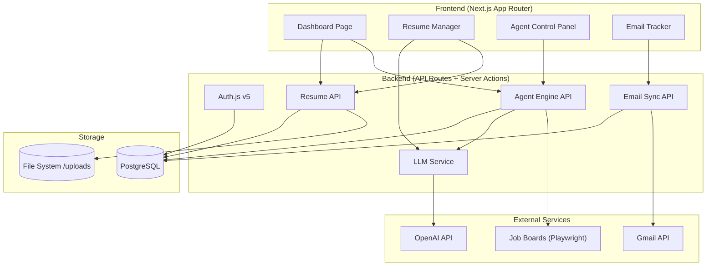

# Mime — AI Job Application Agent

Personal automation tool that browses hiring platforms, tailors resumes per job, auto-applies, tracks application status, and monitors email for updates.

---

## Decisions (Approved)

- **Database**: PostgreSQL + Prisma
- **LLM**: OpenAI API (`openai` npm package) — will switch to Claude/Gemini when credits run out
- **Auth**: Google OAuth (doubles as Gmail access grant)
- **Platforms**: Naukri, Instahyre, Wellfound, Indeed, company career pages (India-focused)
- **Agent model**: Human-in-the-loop — agent discovers + scores + tailors, user approves before submission
- **Deployment**: Local-only for now
- **Google Cloud**: Set up from scratch (instructions included)

---

## Tech Stack

| Layer | Technology |
|---|---|
| Framework | Next.js 15 (App Router, TypeScript) |
| Styling | TailwindCSS v4 |
| UI Components | shadcn/ui (latest CLI) |
| Icons | `@phosphor-icons/react` |
| Database | PostgreSQL + Prisma ORM |
| Auth | Auth.js v5 (`next-auth@beta`) + Google OAuth |
| AI/LLM | OpenAI API (`openai`) |
| Email | Gmail API (`googleapis`) via same Google OAuth |
| File Storage | Local filesystem (`/uploads`) + DB metadata |
| Job Scraping | Playwright (headless browser automation) |
| PDF Generation | `@react-pdf/renderer` for resume output |
| Scheduling | `node-cron` for periodic job scanning |

---

## Architecture Overview



---

## Project Structure

```
mime/
├── app/
│   ├── layout.tsx                    # Root layout (fonts, theme provider)
│   ├── page.tsx                      # Landing / redirect to dashboard
│   ├── globals.css                   # Tailwind base + custom tokens
│   ├── (auth)/
│   │   ├── login/page.tsx            # Login page
│   │   └── layout.tsx                # Auth layout (centered card)
│   ├── (dashboard)/
│   │   ├── layout.tsx                # Dashboard shell (sidebar + topbar)
│   │   ├── page.tsx                  # Main dashboard (stats + recent apps)
│   │   ├── applications/
│   │   │   └── page.tsx              # Applications table view
│   │   ├── resumes/
│   │   │   ├── page.tsx              # Resume list
│   │   │   └── [id]/page.tsx         # Resume detail/editor
│   │   ├── agent/
│   │   │   └── page.tsx              # Agent control panel
│   │   ├── emails/
│   │   │   └── page.tsx              # Email inbox viewer
│   │   └── settings/
│   │       └── page.tsx              # User settings
├── components/
│   ├── ui/                           # shadcn/ui primitives
│   ├── layout/
│   │   ├── sidebar.tsx               # App sidebar navigation
│   │   ├── topbar.tsx                # Top header bar
│   │   └── theme-toggle.tsx          # Dark/light mode toggle
│   ├── dashboard/
│   │   ├── stats-cards.tsx           # Summary stat cards
│   │   ├── recent-applications.tsx   # Recent apps mini-table
│   │   └── activity-chart.tsx        # Application activity chart
│   ├── applications/
│   │   ├── applications-table.tsx    # Full data table
│   │   ├── application-columns.tsx   # Column definitions
│   │   ├── status-badge.tsx          # Status pill component
│   │   └── application-filters.tsx   # Filter controls
│   ├── resumes/
│   │   ├── resume-upload.tsx         # Drag-drop upload
│   │   ├── resume-card.tsx           # Resume preview card
│   │   └── resume-preview.tsx        # PDF preview modal
│   ├── agent/
│   │   ├── agent-status.tsx          # Live agent status indicator
│   │   ├── job-queue.tsx             # Pending jobs for approval
│   │   └── agent-config.tsx          # Agent preferences form
│   └── emails/
│       ├── email-list.tsx            # Email thread list
│       └── email-detail.tsx          # Single email view
├── lib/
│   ├── db.ts                         # Prisma client singleton
│   ├── auth.ts                       # Auth.js config
│   ├── utils.ts                      # cn() + helpers
│   ├── ai/
│   │   ├── openai.ts                 # OpenAI client setup
│   │   ├── resume-tailor.ts          # Resume tailoring prompts + logic
│   │   └── job-matcher.ts            # Job-resume fit scoring
│   ├── agent/
│   │   ├── scraper.ts                # Playwright job scraper
│   │   ├── engine.ts                 # Agent orchestration logic
│   │   └── platforms/
│   │       ├── naukri.ts             # Naukri-specific scraper
│   │       ├── instahyre.ts          # Instahyre-specific scraper
│   │       ├── wellfound.ts          # Wellfound-specific scraper
│   │       └── indeed.ts             # Indeed-specific scraper
│   ├── email/
│   │   ├── gmail-client.ts           # Gmail API wrapper
│   │   └── email-parser.ts           # Parse application status emails
│   └── resume/
│       ├── parser.ts                 # PDF/DOCX resume parser
│       └── generator.ts              # Generate tailored resume PDF
├── prisma/
│   └── schema.prisma                 # Database schema
├── hooks/
│   ├── use-applications.ts           # Applications data hook
│   ├── use-agent-status.ts           # Agent status polling
│   └── use-emails.ts                 # Email data hook
├── types/
│   └── index.ts                      # Shared TypeScript types
├── public/
│   └── uploads/                      # Resume file storage
├── middleware.ts                      # Auth middleware
├── next.config.ts
├── tailwind.config.ts
├── .env.local                         # Secrets (gitignored)
└── package.json
```

---

## Proposed Changes

### Phase 1 — Project Scaffolding & Design System

Bootstrap the Next.js project, install all dependencies, configure TailwindCSS + shadcn/ui, set up the design tokens and global styles.

#### [NEW] Project initialization (shell commands)

```bash
# Create Next.js 15 app
npx -y create-next-app@latest ./ --typescript --tailwind --eslint --app --src=no --import-alias "@/*"

# shadcn/ui
npx shadcn@latest init -d

# Core shadcn components
npx shadcn@latest add button card table badge input dialog dropdown-menu avatar separator tabs sheet scroll-area tooltip progress select command

# Dependencies
npm install @phosphor-icons/react
npm install next-auth@beta @auth/prisma-adapter
npm install prisma @prisma/client
npm install googleapis openai
npm install playwright pdf-parse react-dropzone
npm install @react-pdf/renderer
npm install recharts date-fns
npm install next-themes
```

#### [NEW] `app/globals.css`
Custom design tokens: dark mode palette with deep blue-violet primary, glass effects, smooth transitions. Premium dark-first aesthetic.

#### [NEW] `app/layout.tsx`
Root layout: Inter font from Google Fonts, `ThemeProvider` (next-themes), global metadata/SEO.

---

### Phase 2 — Database & Auth

#### [NEW] `prisma/schema.prisma`

Data models:

```prisma
model User {
  id            String    @id @default(cuid())
  name          String?
  email         String    @unique
  emailVerified DateTime?
  image         String?
  password      String?
  accounts      Account[]
  sessions      Session[]
  resumes       Resume[]
  applications  Application[]
  agentConfigs  AgentConfig[]
  createdAt     DateTime  @default(now())
  updatedAt     DateTime  @updatedAt
}

model Resume {
  id              String        @id @default(cuid())
  userId          String
  user            User          @relation(fields: [userId], references: [id])
  name            String        // "Master Resume" / "Tailored for Google SWE"
  originalFile    String        // Path to uploaded file
  parsedContent   Json          // Structured resume data (parsed)
  isMaster        Boolean       @default(false)
  parentResumeId  String?       // Links tailored → master
  applications    Application[]
  createdAt       DateTime      @default(now())
  updatedAt       DateTime      @updatedAt
}

model Application {
  id              String           @id @default(cuid())
  userId          String
  user            User             @relation(fields: [userId], references: [id])
  resumeId        String?
  resume          Resume?          @relation(fields: [resumeId], references: [id])
  company         String
  jobTitle        String
  jobUrl          String
  jobDescription  String           @db.Text
  platform        String           // "linkedin" | "indeed" | "direct"
  status          ApplicationStatus @default(QUEUED)
  fitScore        Float?           // 0-100 AI match score
  appliedAt       DateTime?
  notes           String?          @db.Text
  emailThreads    EmailThread[]
  createdAt       DateTime         @default(now())
  updatedAt       DateTime         @updatedAt
}

enum ApplicationStatus {
  QUEUED          // Found by agent, awaiting approval
  APPROVED        // User approved, ready to apply
  APPLYING        // Agent is submitting
  APPLIED         // Successfully submitted
  VIEWED          // Employer viewed
  INTERVIEWING    // Interview stage
  OFFERED         // Received offer
  REJECTED        // Rejected
  WITHDRAWN       // User withdrew
}

model EmailThread {
  id              String       @id @default(cuid())
  applicationId   String?
  application     Application? @relation(fields: [applicationId], references: [id])
  gmailThreadId   String       @unique
  subject         String
  snippet         String
  from            String
  lastMessageDate DateTime
  isRead          Boolean      @default(false)
  rawMessages     Json         // Full message data
  createdAt       DateTime     @default(now())
  updatedAt       DateTime     @updatedAt
}

model AgentConfig {
  id              String   @id @default(cuid())
  userId          String
  user            User     @relation(fields: [userId], references: [id])
  targetRoles     String[] // ["Software Engineer", "Frontend Developer"]
  targetLocations String[] // ["Remote", "San Francisco"]
  minSalary       Int?
  platforms       String[] // ["linkedin", "indeed"]
  autoApply       Boolean  @default(false) // HITL toggle
  dailyLimit      Int      @default(20)
  isActive        Boolean  @default(false)
  createdAt       DateTime @default(now())
  updatedAt       DateTime @updatedAt
}
```

#### [NEW] `lib/db.ts`
Prisma client singleton (dev hot-reload safe).

#### [NEW] `lib/auth.ts`
Auth.js v5 config — Google OAuth provider with Prisma adapter. Requests Gmail scopes (`gmail.readonly`) during OAuth flow so we get email access for free.

#### [NEW] `app/api/auth/[...nextauth]/route.ts`
Auth API route handler.

#### [NEW] `middleware.ts`
Protect all `/(dashboard)` routes — redirect unauthenticated users to `/login`.

#### [NEW] `app/(auth)/login/page.tsx`
Login page: dark glassmorphism card, "Sign in with Google" button (single OAuth flow for auth + Gmail).

---

### Phase 3 — Resume Management

#### [NEW] `lib/resume/parser.ts`
Parse uploaded PDF/DOCX → structured JSON (sections: contact, summary, experience, education, skills).

#### [NEW] `lib/resume/generator.ts`
Generate tailored resume PDF from structured data using `@react-pdf/renderer`.

#### [NEW] `lib/ai/openai.ts`
OpenAI client setup (GPT-4o for resume tailoring, GPT-4o-mini for fit scoring).

#### [NEW] `lib/ai/resume-tailor.ts`
Core resume tailoring logic:
- Input: master resume JSON + job description
- Prompt: Rewrite bullet points to highlight relevant experience, inject keywords, reorder sections for ATS optimization
- Output: tailored resume JSON
- Guardrail: never fabricate experience, only reframe existing data

#### [NEW] `app/(dashboard)/resumes/page.tsx`
Resume list: grid of `resume-card` components, upload button, master resume indicator.

#### [NEW] `app/(dashboard)/resumes/[id]/page.tsx`
Resume detail: side-by-side view (original vs. tailored), edit structured data, download PDF.

#### [NEW] `components/resumes/resume-upload.tsx`
Drag-drop zone (`react-dropzone`), file validation (PDF/DOCX, max 5MB), upload progress.

#### [NEW] `components/resumes/resume-card.tsx`
Card with resume name, creation date, linked application count, preview thumbnail, download action.

#### [NEW] API routes: `app/api/resumes/route.ts`, `app/api/resumes/[id]/route.ts`
CRUD operations for resumes — upload, parse, list, get, delete.

#### [NEW] `app/api/resumes/[id]/tailor/route.ts`
POST: accepts job description, calls Gemini to tailor resume, saves new tailored variant.

---

### Phase 4 — Applications Dashboard

#### [NEW] `app/(dashboard)/page.tsx`
Main dashboard with:
- 4 stat cards (Total Applied, Interviewing, Offers, Response Rate)
- Application activity line chart (recharts)
- Recent applications mini-table (last 5)
- Agent status indicator

#### [NEW] `app/(dashboard)/applications/page.tsx`
Full applications view: shadcn DataTable with sorting, filtering, pagination.

#### [NEW] `components/applications/applications-table.tsx`
TanStack Table integration with shadcn `<Table>`. Columns: Company, Role, Platform, Status, Fit Score, Applied Date, Actions.

#### [NEW] `components/applications/status-badge.tsx`
Color-coded status pills using shadcn `<Badge>` variants:
- QUEUED → amber
- APPLIED → blue
- INTERVIEWING → violet
- OFFERED → emerald
- REJECTED → red

#### [NEW] `components/applications/application-filters.tsx`
Filter bar: status multi-select, platform filter, date range, search by company/role.

#### [NEW] `components/dashboard/stats-cards.tsx`
Glassmorphic stat cards with Phosphor icons, animated counters.

#### [NEW] `components/dashboard/activity-chart.tsx`
Recharts area chart — applications over time, color-coded by status.

#### [NEW] API routes: `app/api/applications/route.ts`
GET (list with filters/pagination), POST (create), PATCH (update status).

---

### Phase 5 — AI Agent Engine

#### [NEW] `lib/agent/engine.ts`
Agent orchestrator:
1. **Scan** — Run Playwright scrapers on configured platforms
2. **Match** — Score each job against master resume via Gemini
3. **Tailor** — Generate custom resume for jobs above fit threshold
4. **Queue** — Create `Application` records with `QUEUED` status
5. **Apply** (if autoApply) — Submit via Playwright form automation

#### [NEW] `lib/agent/scraper.ts`
Base scraper class with Playwright: navigate, extract job listings (title, company, description, URL, salary).

#### [NEW] `lib/agent/platforms/naukri.ts`
Naukri.com job search scraper — keyword + location search, paginate results. India's largest job board.

#### [NEW] `lib/agent/platforms/instahyre.ts`
Instahyre scraper — invite-based platform, scrape available listings.

#### [NEW] `lib/agent/platforms/wellfound.ts`
Wellfound (AngelList) scraper — startup-focused listings.

#### [NEW] `lib/agent/platforms/indeed.ts`
Indeed India scraper — similar pattern, `indeed.co.in` domain.

#### [NEW] `lib/ai/job-matcher.ts`
OpenAI-powered fit scoring (GPT-4o-mini for cost efficiency):
- Input: resume skills/experience + job description
- Output: 0–100 fit score + reasoning + missing skills list

#### [NEW] `app/(dashboard)/agent/page.tsx`
Agent control panel:
- Start/stop toggle
- Configuration form (target roles, locations, platforms, daily limit, auto-apply toggle)
- Live job queue — approve/reject discovered jobs
- Agent activity log

#### [NEW] `components/agent/agent-status.tsx`
Animated status indicator (idle/scanning/matching/applying) with pulse animation.

#### [NEW] `components/agent/job-queue.tsx`
List of `QUEUED` applications — job card with fit score, company, role, tailored resume preview, approve/reject buttons.

#### [NEW] `app/api/agent/route.ts`
POST `/api/agent/start` — triggers agent scan cycle.
POST `/api/agent/stop` — stops agent.
GET `/api/agent/status` — current agent state.

---

### Phase 6 — Email Integration

#### [NEW] `lib/email/gmail-client.ts`
Gmail API wrapper:
- OAuth2 token management (store refresh token in DB)
- Fetch inbox messages filtered by hiring-related senders
- Mark as read, archive

#### [NEW] `lib/email/email-parser.ts`
Parse email content to detect application status updates:
- Pattern matching: "moved to next round", "unfortunately", "offer letter", "interview scheduled"
- Auto-link emails to existing `Application` records by company name matching
- Update application status when status-change email detected

#### [NEW] `app/(dashboard)/emails/page.tsx`
Email inbox view:
- List of synced emails with subject, sender, date, linked application
- Detail panel showing full email
- Manual link-to-application action

#### [NEW] `components/emails/email-list.tsx`
Scrollable email thread list, unread indicators, linked application badge.

#### [NEW] `components/emails/email-detail.tsx`
Email content renderer — sanitized HTML display.

#### [NEW] `app/api/emails/route.ts`
GET — fetch synced emails.
POST `/api/emails/sync` — trigger Gmail sync.

---

### Phase 7 — Dashboard Shell & Polish

#### [NEW] `app/(dashboard)/layout.tsx`
Dashboard layout: collapsible sidebar + top bar + main content area. Dark theme default.

#### [NEW] `components/layout/sidebar.tsx`
Sidebar navigation with Phosphor icons:
- Dashboard (`House`)
- Applications (`Briefcase`)
- Resumes (`FileText`)
- Agent (`Robot`)
- Emails (`Envelope`)
- Settings (`GearSix`)

Collapsible with animated transitions, active route highlighting.

#### [NEW] `components/layout/topbar.tsx`
Top bar: app logo/name, global search (shadcn `<Command>`), notifications bell, user avatar dropdown.

#### [NEW] `components/layout/theme-toggle.tsx`
Dark/light mode toggle with `next-themes`.

#### [NEW] `app/(dashboard)/settings/page.tsx`
Settings page: profile info, Gmail connection status, API key management, agent preferences.

---

## Visual Design Direction

| Aspect | Choice |
|---|---|
| Color Scheme | Deep slate/zinc dark mode base, violet-500 primary accent, emerald/amber/rose for status |
| Typography | Inter (Google Fonts) — clean, modern, great readability |
| Cards | Glassmorphic: `bg-white/5 backdrop-blur-xl border border-white/10` |
| Animations | Framer-motion-free: CSS transitions on hover/focus, animated stat counters, pulse for live indicators |
| Layout | Fixed sidebar (240px collapsed to 64px) + fluid content area |
| Tables | Zebra striping, sticky headers, row hover glow effect |
| Dark Mode | Default and primary, light mode as secondary option |

---

## Verification Plan

### Automated Tests
```bash
# Type checking
npx tsc --noEmit

# Lint
npm run lint

# Prisma schema validation
npx prisma validate

# Build verification
npm run build
```

### Manual Verification
- [ ] Login flow works (credentials + optional Google OAuth)
- [ ] Resume upload, parse, and preview render correctly
- [ ] Tailored resume generation produces valid, non-fabricated output
- [ ] Applications table sorts, filters, paginates correctly
- [ ] Agent discovers jobs and queues them for approval
- [ ] Email sync pulls messages and auto-links to applications
- [ ] Responsive layout works at mobile/tablet/desktop
- [ ] Dark/light theme toggle functions
- [ ] All Phosphor icons render correctly

### Phase-by-Phase Verification
Each phase will be verified independently before moving to the next:
1. **Phase 1**: `npm run dev` starts, shadcn components render, design tokens apply
2. **Phase 2**: Login works, DB migrations succeed, protected routes redirect
3. **Phase 3**: Upload → parse → tailor → download flow complete
4. **Phase 4**: Dashboard renders with mock data, table interactions work
5. **Phase 5**: Agent scan returns real job listings, fit scoring produces reasonable scores
6. **Phase 6**: Gmail sync pulls real emails, parser detects status updates
7. **Phase 7**: Full app polish pass, all pages connected, smooth navigation
